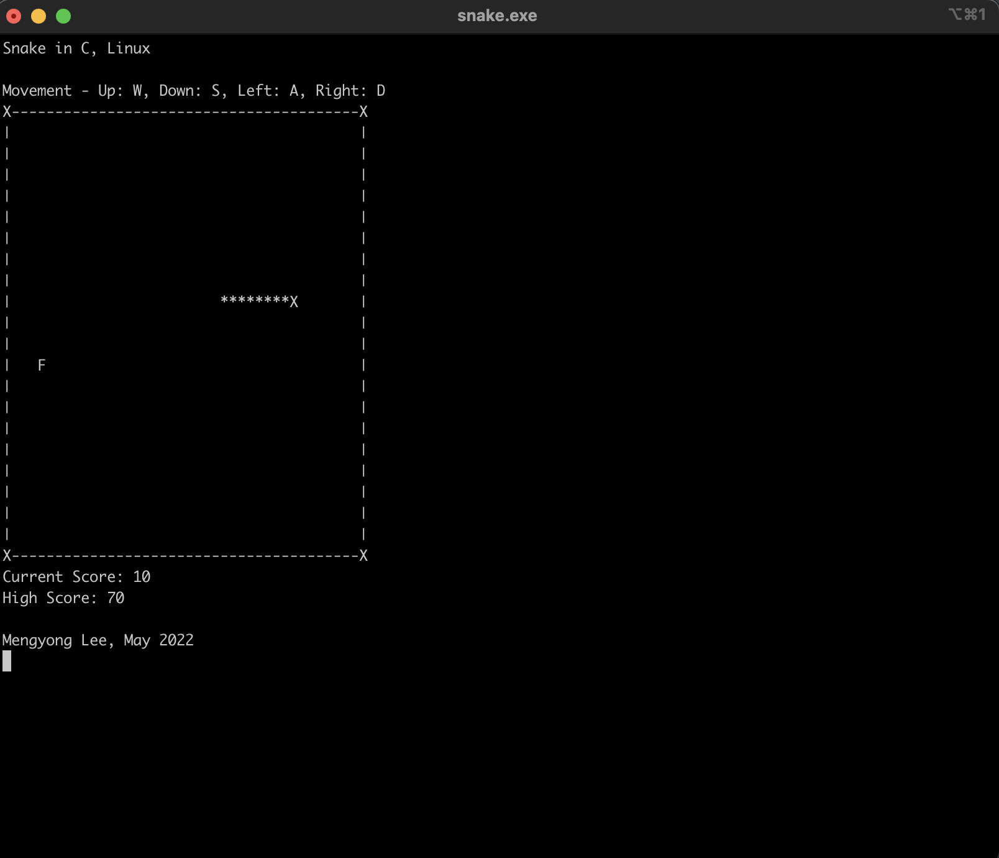

# Running Snake on C, Linux
To run: `clear && gcc main.c -o snake.exe -lncurses && ./snake.exe`

## Acknowledgement 
- Walk-through video from: https://www.youtube.com/playlist?list=PL3pKgZpYZLjmNpbeZrcL8pBSq3YPb-8G6
- Codes modified from: Sanzaal https://github.com/pawanprjl/Snake-Game-in-C

## Screenshot

